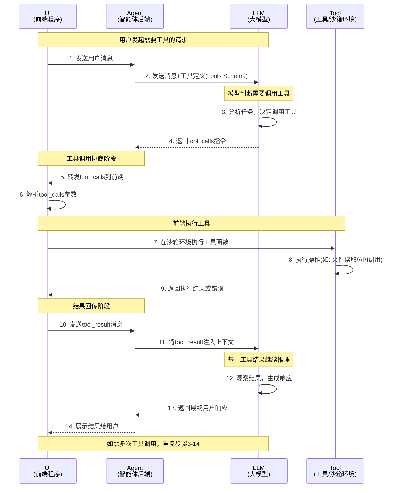
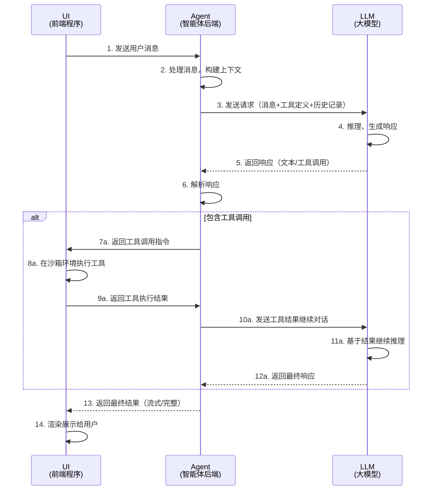
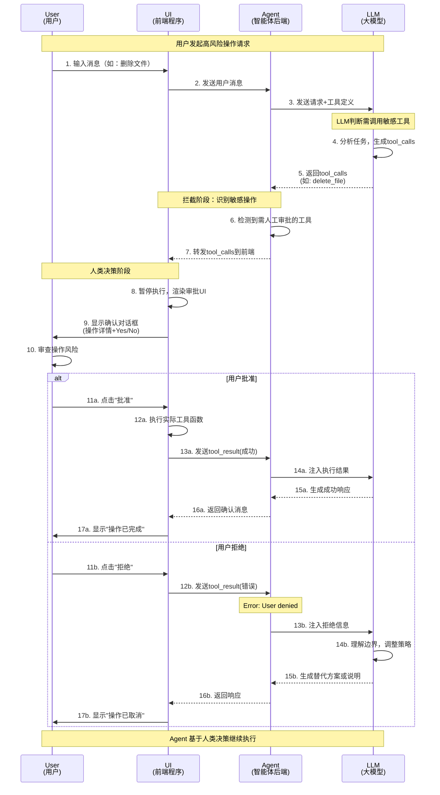

# 面向前端开发的 AI Agent 核心场景实操指南

## 1. 绪论：从“对话框”到“代理执行器”

在传统 AI 应用中，我们构建的是 **Chatbot**（聊天机器人），这是一种“单次请求-响应”的无状态操作。而 **AI Agent**（智能体）的兴起标志着范式的转移：模型不再仅仅是回答问题，而是作为驱动任务的**执行引擎**。

> **核心公式：**

对于前端开发者而言，这一转变意味着角色的深度升级：你不再仅仅是渲染 Markdown 文本，而是成为了 **“执行环境的宿主”**，负责管理复杂的异步状态机、维护消息流的完整性，并把控安全性边界。

### Agent 与普通 Chatbot 的三大核心差异

- **决策能力 (LLM in the Driver's Seat)**：模型自主决定“下一步做什么”，而非由预设程序控制。
- **动作执行 (ReAct 模式)**：采用 **Reason + Act** 模式。模型先推理（Reason），发起 Action（工具调用），通过观察结果（Observe）进入下一个循环。
- **自主循环 (Loop)**：过程是迭代的。Agent 会持续工作并自我纠正，直到任务完成。

---

## 2. Tool Call：前端作为能力的“执行边界”

**Tool Call** 是 Agent 互动的基石。其核心原则是：**模型从不亲自执行代码，它只生成“调用意图（Intent）”**。

### 交互序列与能力集 (Capability Set)

前端负责提供 Agent 的“能力集”，如文件系统操作、Web 搜索或 Shell 访问。

1. **意图识别**：LLM 返回 `tool_calls`。
2. **执行边界**：前端捕获指令，在本地环境（浏览器或 Node.js）执行函数。
3. **结果回传**：前端将结果作为 `tool_result` 发回 LLM 以完成闭环。

### 工具调用时序图



### 安全性与沙箱化 (Sandboxing)

作为架构师，必须关注 **“爆炸半径（Blast Radius）”**。

- **风险**：直接在宿主机执行 `rm -rf` 是灾难性的。
- **方案**：在生产环境中，应将执行环境 **沙箱化**（利用 Docker、gVisor 或 Firecracker），确保即使 Prompt 注入成功，损害也被限制在隔离环境中。

### 数据格式范例 (AI SDK 标准)

**Assistant 消息 (下发意图):**

```json
{
  "role": "assistant",
  "tool_calls": [
    {
      "id": "call_987xyz",
      "type": "function",
      "function": {
        "name": "run_shell_command",
        "arguments": "{\"command\": \"ls -la\"}"
      }
    }
  ]
}
```

**Tool 消息 (回传结果):**

```json
{
  "role": "tool",
  "tool_call_id": "call_987xyz", // 必须严格一致
  "content": "total 8\ndrwxr-xr-x  2 user  staff   64 Jan 20 10:00 ."
}
```

---

## 3. Reasoning：理解 Agent 的“思考”逻辑

### 对话流程时序图



推理场景常见于高性能模型（如 OpenAI o1 或 Anthropic 推理模式）。模型在输出答案前会进行密集的内部逻辑迭代。

- **流式处理**：利用 AI SDK 从流中提取 `reasoning_content`。
- **UI 模式**：建议采用**折叠面板（Accordion）**展示思考过程。公开推理过程能显著提升用户对 Agent 决策的信任度。

---

## 4. Chain of Thought (CoT)：ReAct 模式下的状态管理

在处理复杂任务时，Agent 会进入 **ReAct (Reason -> Act -> Observe)** 循环。

### 状态机思维

前端应将 `messages` 数组视为应用的 **“唯一事实来源（Source of Truth）”**：

1. **Reason**：模型生成思考文本。
2. **Act**：模型发起一个或多个 `tool_calls`。
3. **Observe**：前端将 `tool_result` 注入消息流。

> [!TIP]
> **步数熔断 (Max Steps)**：始终设置 `maxSteps` 参数（建议 5-10 步）。这能有效防止 Agent 进入逻辑死循环，避免 Token 成本失控。

---

## 5. Human-in-the-Loop (HITL)：人机协作的拦截架构

对于支付、删除数据等高价值操作，必须引入人类干预。

### HITL 时序图



### 拦截架构实现

根据最佳实践，可以在服务器端工具定义中**省略 `execute` 函数**。这会强制将工具调用意图转发至前端进行审批。

- **拦截**：前端检测到 `tool_calls`。
- **挂起**：UI 渲染审批组件（Yes/No），逻辑处于等待状态。
- **决策注入**：
- **批准**：执行并调用 `addToolOutput`。
- **拒绝**：回传特定错误格式，引导模型理解用户边界。

```typescript
// 前端审批逻辑示例
const handleApproval = async (toolCallId: string, confirmed: boolean) => {
  if (confirmed) {
    const result = await runActualTool();
    await addToolOutput({ toolCallId, output: result });
  } else {
    await addToolOutput({
      toolCallId,
      output: "Error: User denied access to this operation.",
    });
  }
  sendMessage(); // 恢复 Agent 运行
};
```

---

## 6. 约束管理：上下文窗口与消息压缩

Agent 的最大挑战是 **上下文窗口限制**。大量的工具返回结果（如 Web 搜索）会迅速耗尽 Token。

### 压缩与总结策略 (Compaction)

1. **80% 阈值**：当估算 Token 占用达到上下文窗口的 80% 时触发。
2. **总结逻辑 (Summarization)**：调用 LLM 对历史 `messages` 进行摘要处理。
3. **种子重置**：清空旧消息，将“摘要消息”作为新的 System/Assistant 种子注入，保留状态并释放空间。

---

## 总结：前端消息驱动架构金律

- **结构化处理**：停止处理纯字符串，转向处理结构化对象 (`role`, `content`, `tool_calls`)。
- **能力隔离**：区分原生工具（Provider 执行）与自定义工具（前端执行）。
- **错误鲁棒性**：当工具失败时，必须将 Error 封装成 `tool_result` 发给模型，让其尝试自我修复。

---

**您是否需要我为您生成一个基于 React 的 `useAgent` 状态管理 Hook 示例代码，以便更好地落地上述逻辑？**
